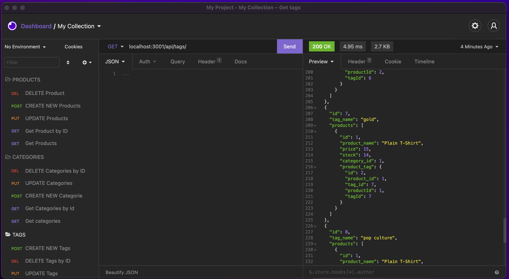

# Online-Shop-BackEnd

## Description
Online-Shop-BackEnd  is an e-commerce Back-End aplication that use Express.js API and Sequelize to interact with a MySQL database. This application displays creation of database using mySQL with models and associations.

## Core Skills

* Node.js
* Sequelize
* express.js API
* Object-Relational Mapping (ORM)

## Mock-Up

## Review

* Video demo that showcase the utilization of the app
  * [demo](https://watch.screencastify.com/v/LBBdJ9LnOpdETEjEXCox)

* The URL of the GitHub repository 
* [Repository](https://github.com/Chrisolsen1993/Online-Shop-BackEnd)

